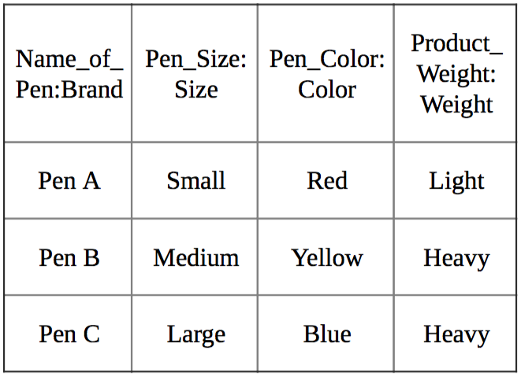

# **Database Systems**
Database Systems practices with T-SQL using Microsoft SQL Server

# Introduction to Database Systems

## What Is Database?
Collection of information (data).

## Database Structures
1. **Hierarchical**

It consists of parent-child relationships. Parent nodes can have multiple child nodes. Child nodes, however, can have only one parent node. Therefore, this structure is inflexible.

2. **Network**

It solves the problem of the hierarchical structure. Information is organized by "record types". A record type can work with other record types. It supports complicated searches and relationships. The complexity, however, is the main disadventage; because you need to know how the structure works and how information is stored.

3. **Relational**

The most popular structure. It is a tabular database in which data is defined so that it can be reorganized and accessed in multiple ways. Relational database is made up of a set of tables with data fits into a predefined category.

## Relational Database Management System

The main element of a relational database is the **relation**, which are essentially groups of rows and columns placed in a table that represents one object. 

### Table

Database object that consists of row and colums, and store data. It is the simplest form of data storage in relational databases. 
- Example: EMPLOYEE table


### Field

Smaller entity of a table that is designed to maintain specific information about every recordin the table.
- Example: Position Title, Education Requirements, Functional Area, Max Pay, Min Pay

### Record

A row in a table. 
- Example: Record of Executive Assistant

### Entity, Attribute, Domain

Entities are things about which information is gathered. Fields represents the attributes of the entity. Attributes are units that define or characterize entities. Example: the entity is a pen with size, color and weight as attributes.



In the table, all of the attributes have a domain that specifies which kind of information is stored in the attribute. Do not confuse domains with data types. Data types are special constraints linked with columns, while domains are description of information in the attributes. In the example, attribute is Name_of_Pen while the domain is Brand. It is good to use a domain that describes the attribute, because it can help you improve the usability and readability of database entries.

### SQL

Structured Query Language is designed for relational databases. It is not procedural programming language such as Java, C, C++. It does not define how a program must perform its functions. It focuses on the results of a program's functions.

### SQL Statements

While managing a database, we can use different types of statements, divided according to their functions.

1. **Data Definition Language (DDL)**

The statements that generate, delete or modify database objects such as schema, table, trigger.
- Example: CREATE TABLE, ALTER TABLE, DROP TABLE

2. **Data Control Language (DCL)**

The statements that specify users or programs that can access the objects inside the database.
- Example: GRANT, REVOKE

3. **Data Manipulation Language (DML)**

The statements that add, modify, delete, or retrieve information stored inside the database.
- Example: SELECT, UPDATE, INSERT, DELETE

### Data Types (Transact-SQL)

Data types define what type of data a column can contain.

- Exact Numerics
	- bigint, bit, decimal, int, money, numeric, smallint, smallmoney, tinyint
- Approximate Numerics
	- float, real
- Date and Time
	- date, datetime2, datetime, datetimeoffset, smalldatetime, time
- Character Strings
	- char, text, varchar
- Unicode Character Strings
	- nchar, ntext, nvarchar
- Binary Strings
	- binary, image, varbinary
- Other Data Types
	- cursor, hierarchyid, sql_variant, table, timestamp, uniqueidentifier, xml


### NULL Value

A NULL value is a value in a field that appears to be blank, which means a field with a NULL value is a field with no value. NULL value is different than a zero value or an empty text value. It can be determined and assigned a value in the future.

### SQL Constraints

Some most commonly used constraints are:

- **NOT NULL:** Ensures that a column cannot have a NULL value.
- **DEFAULT:** Provides a default value for a column when none is specified.
- **UNIQUE:** Prevents two records from having identical values in a column.
- **PRIMARY KEY:** A primary key is a field in a table which uniquely identifies each row/record in a database table. Primary keys must contain unique values. A primary key column cannot have NULL values.

Primary Keys index and physically order tables. Looking up the values by using Primary Keys is faster than using other values in a row.
- **FOREIGN KEY:** A Foreign Key is a column or a combination of columns whose values match a Primary Key in a different table. The relationship between 2 tables matches the Primary Key in one of the tables with a Foreign Key in the second table.
- **CHECK:** It ensures that all values in a column satisfy certain conditions.

# Query Practices

### Create Database

There are two kinds of database. 
1. System Database: Database provided by SQL Server Manager Studio for proper functioning of SQL Server.
2. User Defined Database: Any database created by user.

A database can be created graphically by using SQL Server Manager Studio (RDBMS) or typing a query.

```sql
CREATE DATABASE mydb
```

Whenever a database is created, two additional files related with the database are generated. 
1. MDF file (Data File): This is the data file which containts the actual data.
2. LDF file (Transaction Log File): Used to recover the database. 

### Rename Database

If we want to rename our database mydb as "mynewdb"; we use the following query containing DDL a statement.
```sql
ALTER DATABASE mydb MODIFY Name= mynewdb
```

Or we can use **System Stored Procedure** to rename it.
```sql
sp_renameDB 'mydb', 'mynewdb'
```

### Drop Database

We use DROP DDL to delete database instances. It removes the related mdf and ldf files. If we want to delete our new database; then we write:
```sql
DROP DATABASE mynewdb
```

**NOTE:** If the database is in use by another user, deleting query does not work.	It returns an error, saying "Cannot drop database, because it is currently in use". It also shows that the database is in **MULTI-USER MODE**. If it needs to be deleted while in multi-user mode, first the database should be set to **SINGLE-USER MODE**, then it can be deleted. System databases cannot be dropped.

```sql
ALTER DATABASE mynewdb SET SINGLE-USER With Rollback Immediate
```

With Rollback Immediate option, it rollbacks all incomplete transactions and closes the connection to the database.
